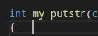

# Whitespaces Remover

## What it does
This Python program removes white spaces from your text files, code, etc.

White spaces are those little extra spaces at the end of your lines that you don't see.



## Installation
You need [Python 3.6+](https://docs.python.org/3.6/tutorial/index.html) to run this program.

You can install the dependencies through PyPI: `python3 -m pip install -r requirements.txt --user`

If you want to you can install this program with the `install.sh` script (for Linux).
```bash
sudo ./install.sh
```
You can also uninstall it using the `uninstall.sh` script.

## Usage
`-d` or `--dry-run` executes the program but doesn't write anything to the files.

`-l` or `--lines` displays lines that contain a whitespace.

`-b` or `--backup` backup each file before processing it. (with a .backup extension)

`-f` or `--force` process files that do not have "safe" extensions, this is to prevent running the program with `*` and breaking your folder.

`--safe-extensions` will display a list of the extensions considered safe.

## Safe extensions
**Note**: More extensions will come over time.

These are the extensions considered safe: .c, .h, .cpp, .py, .cs, .class, .java, .sh, .swift, .vb, .asp, .aspx, .css, .html, .htm, .php, .js, .jsp, .rss, .xml, .json, .rst, .md, .txt